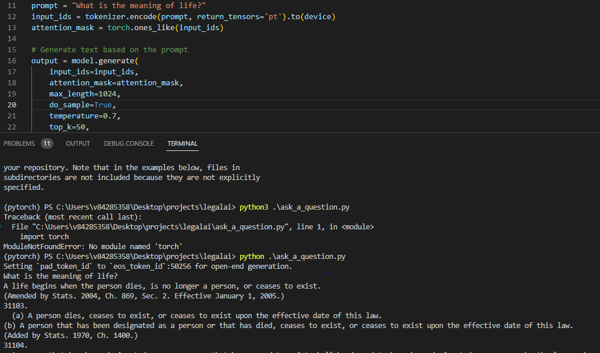

# LegalAI
## AI lawyers to cut out middle-men!


## Finetuning
```python finetune_gpt2_legal.py``` finetunes and generates a fine_tuned_gpt2 model that has "learnt" your document!


## How to use:

### 1. Ask a Question! 

1. Edit line 11 in ask_a_question.py to your question! 
2. ```python ask_a_question.py``` prints the answer!




### 2. Complete a Prompt:

1. Edit line 12 in complete_a_prompt.py, prompt that you want completed!
2. ```python complete_a_prompt.py``` completes and prints your prompt


### 3. Finetune with any legal document:

1. Edit line 9 in finetune_gpt2_legal.py with your legal document
2. ```python finetune_gpt2_legal.py``` finetunes and generates a fine_tuned_gpt2 model that has "learnt" your document!


## Contributions

PRs are welcome!

